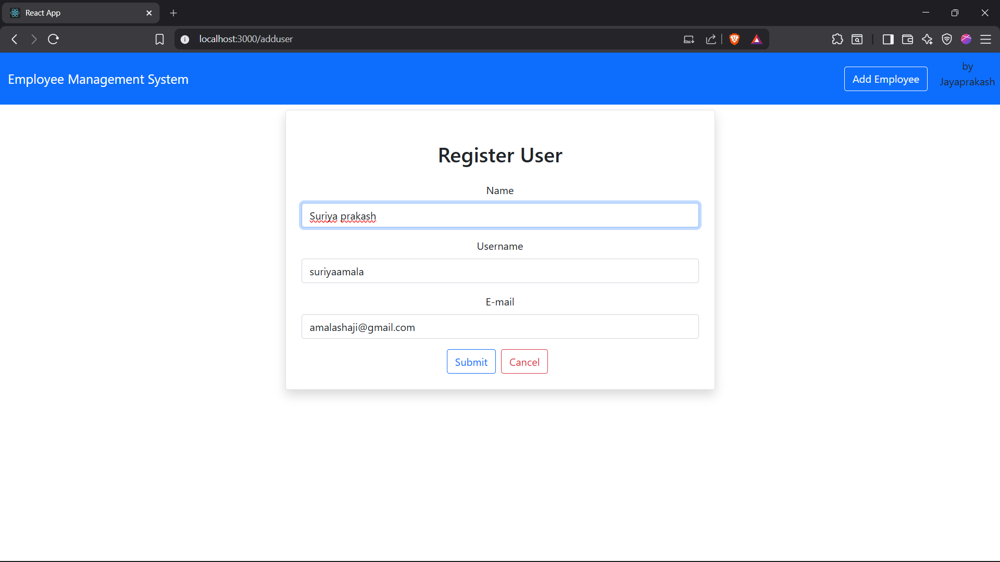
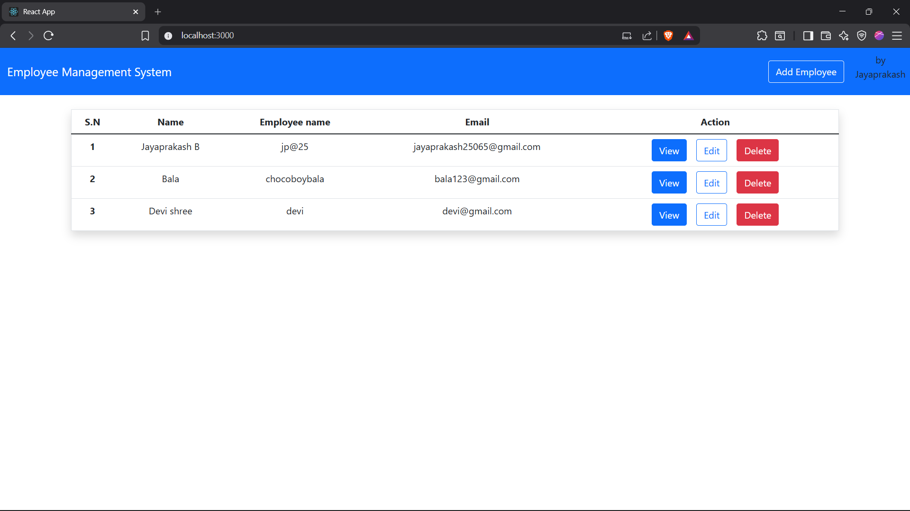

# Employee Management System – Frontend (React)

---

## Contents
- Brief Overview  
- Purpose and Motivation  
- Technologies, Requirements and Tools  
- System Design  
- Application Outputs  

---

## Brief Overview
This project is a **Full Stack Employee Management System** where the back-end exposes RESTful APIs built using **Spring Boot and MySQL**, and the front-end is implemented using **React**.

The APIs were tested using **Postman** and later integrated into the React application using **Axios**.  
The system supports complete **CRUD operations** for employee data management.

This repository contains only the **front-end module**, which serves as the user interface and displays employee information retrieved from the back-end services.

The application allows users to:
- View employee records  
- Add new employees  
- Update existing employee details  
- Remove employees from the system  

This project is currently being used by a **local community sports club** to manage member records.

---

## 🎯 Purpose and Motivation
The main aim of this project was to design and implement a **fully functional end-to-end Full Stack application** using modern technologies.

With a strong interest in improving my full stack development skills, I worked on this project during my personal time to gain practical experience in API development, front-end integration, and database handling.

---

## ⚙️ Technologies, Requirements and Tools

### Programming Languages
- Java  
- JavaScript  
- HTML  
- CSS  
- JSON  

### Frameworks and Libraries
- Spring Boot (Back-end)
- React (Front-end)
- Bootstrap (UI Styling)

### Database
- MySQL

### Tools
- Postman
- Git & GitHub

---

## 🏗️ System Design
The application follows a **client-server architecture**, where:
- React handles the user interface
- Spring Boot provides RESTful services
- MySQL manages persistent data storage
- Axios enables communication between front-end and back-end

---

## 🖼️ Application Outputs

### Dashboard View
```md


